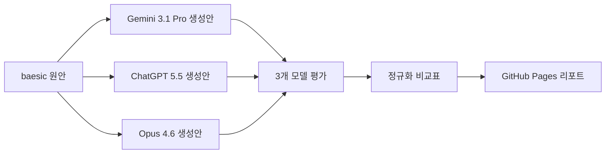

# CompareAIgenerate

동일한 원안을 `Gemini 3.1 Pro`, `ChatGPT 5.5`, `Opus 4.6`으로 블로그 글 형태로 생성한 뒤, 다시 세 모델이 산출물의 품질을 평가한 비교 분석 프로젝트입니다.

이 저장소의 목적은 단순한 글감 비교가 아니라, **AI가 글을 생성하는 방식과 AI가 다시 그 결과물을 평가하는 방식의 차이**를 공개적으로 분석하는 것입니다. GitHub Pages에서 바로 확인 가능한 정적 웹페이지도 함께 제공합니다.

## 바로 보기

- GitHub Pages: [https://baesic.github.io/CompareAIgenerate](https://baesic.github.io/CompareAIgenerate)
- 관련 게시글: [우리는 지금 GPU를 태우는 F1 레이스에 서 있다](https://baesic.com/2026/05/15/우리는-지금-gpu를-태우는-f1-레이스에-서-있다/)

## 핵심 질문

- 같은 원안을 각 모델은 어떤 블로그 문체와 구조로 재구성하는가?
- 평가 모델은 어떤 기준을 더 중요하게 보는가?
- 최종 게시용 글을 고를 때 어떤 모델의 평가가 더 실무적인가?
- 정밀한 비교 리포트를 만들 때 어떤 모델의 평가가 더 설득력 있는가?

## 데이터 구성

| 구분 | 표기 | 모델 | 역할 |
| --- | --- | --- | --- |
| 원안 | 원안 | baesic 작성 | 최초 문제의식과 표현이 담긴 초안 |
| 생성안 | A안 | Gemini 3.1 Pro | 원안을 제목 중심의 요약형 블로그 글로 재구성 |
| 생성안 | B안 | ChatGPT 5.5 | 원안의 취지를 보존한 균형형 블로그 글로 재구성 |
| 생성안 | C안 | Opus 4.6 | 칼럼형 구성과 기술 해설을 강화한 블로그 글로 재구성 |
| 평가 | 평가 1 | Gemini 3.1 Pro | 생성안별 점수와 추천안 평가 |
| 평가 | 평가 2 | ChatGPT 5.5 | 게시 적합성과 실무 편집 관점 평가 |
| 평가 | 평가 3 | Opus 4.6 | 문체, 뉘앙스, 매체 적합성 중심 평가 |

원본 비교 자료는 [first_example.md](./first_example.md)에 정리되어 있습니다.

## 실험 흐름

## 생성 결과 요약

| 생성안 | 성격 | 강점 | 유의점 |
| --- | --- | --- | --- |
| A안 | 핵심 요약형 | 제목과 소제목이 명확하고 빠르게 읽힘 | 원안의 거친 문제의식과 사실 보정의 균형은 다소 약함 |
| B안 | 균형형 게시본 | 원안의 취지를 보존하면서 논리 흐름과 게시 적합성이 가장 안정적 | 칼럼형 인상이나 결말의 여운은 C안보다 약함 |
| C안 | 심층 칼럼형 | 기술 용어, 비유, 마무리의 인상이 강함 | 원안보다 해설이 확장되어 원문 뉘앙스가 일부 이동함 |

## 평가 결과 요약

| 평가 모델 | 원안 | A안 | B안 | C안 | 1순위 | 평가 성향 |
| --- | ---: | ---: | ---: | ---: | --- | --- |
| Gemini 3.1 Pro | 5.75 | 7.75 | 7.25 | 9.25 | C안 | 구조화, 전문성, 시각적 전달력을 높게 평가 |
| ChatGPT 5.5 | 6.8 | 7.4 | 8.8 | 8.3 | B안 | 게시 적합성, 사실 보정, 논리 균형을 중시 |
| Opus 4.6 | 4.5 | 7.1 | 8.5 | 8.0 | B안 | 원문 뉘앙스, 문체 손실, 매체 적합성을 세밀하게 분석 |

## 메타 평가 결론

평가 품질 자체를 기준으로 보면 `Opus 4.6`이 가장 입체적인 분석을 제공합니다. 원안의 생생함이 다듬어지는 과정에서 무엇을 얻고 잃었는지 가장 명확하게 설명하기 때문입니다.

다만 실제 블로그 게시용 글을 빠르게 선택해야 한다면 `ChatGPT 5.5`의 평가가 가장 실무적입니다. `Gemini 3.1 Pro`는 표 중심 요약과 빠른 공유용 자료를 만들 때 강점이 있습니다.

| 활용 목적 | 추천 평가 모델 | 이유 |
| --- | --- | --- |
| 빠른 비교표와 요약 공유 | Gemini 3.1 Pro | 표 구조와 한눈에 보는 전달력이 좋음 |
| 최종 게시본 선정 | ChatGPT 5.5 | 게시 적합성, 사실 보정, 논리 균형 판단이 안정적 |
| 정밀 분석 리포트 작성 | Opus 4.6 | 뉘앙스 손실과 문체 변화까지 깊게 설명 |

## 웹페이지 구성

GitHub Pages용 [index.html](./index.html)은 Markdown 원문 링크에 의존하지 않고, 비교 과정을 웹페이지 안에서 직접 확인할 수 있게 구성했습니다.

- 원안 전문: 스크롤 없는 텍스트 박스로 전체 초안을 한 번에 표시
- A안 Gemini 3.1 Pro 전문: 스크롤 가능한 텍스트 박스로 생성글 전체 표시
- B안 ChatGPT 5.5 전문: 스크롤 가능한 텍스트 박스로 생성글 전체 표시
- C안 Opus 4.6 전문: 스크롤 가능한 텍스트 박스로 생성글 전체 표시
- 모델별 원문 평가표: Gemini 3.1 Pro, ChatGPT 5.5, Opus 4.6의 평가표 전체를 웹 표로 재구성
- 공통점 기반 분석: 세 평가표에서 반복되는 결론을 카드형 요약으로 제공
- 정규화 시각화: 서로 다른 배점 체계를 10점 기준으로 맞춰 점수 카드와 막대 그래프로 표시

원본 Markdown 파일인 [first_example.md](./first_example.md)와 평가 방법론 문서인 [docs/methodology.md](./docs/methodology.md)는 GitHub 저장소 설명과 재현성 확인을 위한 근거 자료입니다. 실제 독자용 비교 경험은 웹페이지에서 바로 확인하도록 설계했습니다.

## GitHub Pages

이 저장소는 루트 정적 파일 구조이므로 GitHub Pages에서 바로 배포할 수 있습니다.

1. GitHub 저장소의 `Settings > Pages`로 이동합니다.
2. 배포 소스를 `Deploy from a branch`로 설정합니다.
3. 브랜치를 `main`, 폴더를 `/root`로 선택합니다.
4. 저장 후 [https://baesic.github.io/CompareAIgenerate](https://baesic.github.io/CompareAIgenerate)에서 리포트를 확인합니다.

## 저장소 구성

| 파일 | 설명 |
| --- | --- |
| [index.html](./index.html) | GitHub Pages용 메인 비교 리포트 |
| [styles.css](./styles.css) | 정적 페이지 스타일 |
| [script.js](./script.js) | 비교 데이터와 시각화 렌더링 |
| [first_example.md](./first_example.md) | 원안, 생성안, 평가 원문 |
| [docs/methodology.md](./docs/methodology.md) | 실험 방법과 평가 기준 |
| [LICENSE](./LICENSE) | MIT 라이선스 |
| [.gitignore](./.gitignore) | 불필요한 로컬 메타 파일 제외 |

## 링크

- 제작자: `baesic`
- GitHub Pages: [https://baesic.github.io/CompareAIgenerate](https://baesic.github.io/CompareAIgenerate)
- 관련 글 및 결과물: [우리는 지금 GPU를 태우는 F1 레이스에 서 있다](https://baesic.com/2026/05/15/우리는-지금-gpu를-태우는-f1-레이스에-서-있다/)

## 라이선스

이 프로젝트는 [MIT License](./LICENSE)를 따릅니다.
